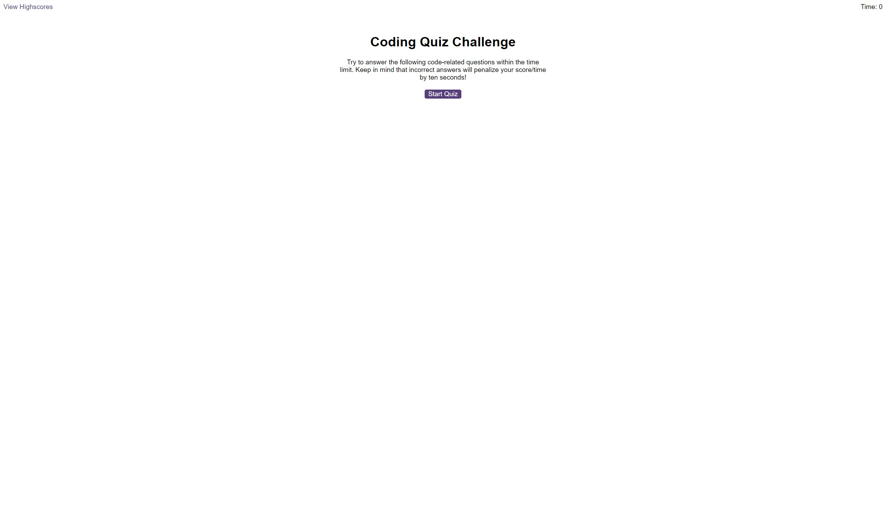

# Javascript Code Quiz 

This code quiz project is a work in progress, there are still these elements to add:
- subtract time when an answer is incorrect
- give user feedback to correct and incorrect answers
- save the initials of a user who attempts the quiz 
- save high scores to a leaderboard 

The code quiz is a 5 question quiz for users to test their knowledge of Javascript. 

https://smntsng.github.io/code-quiz/

## Instructions
1. click the "Start Quiz" button 
2. play through the 5 questions

## License

